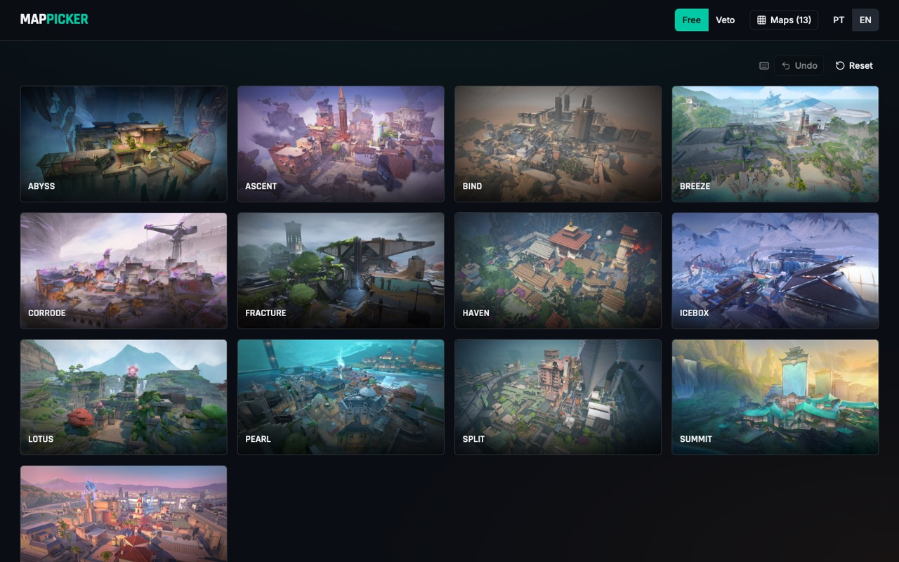
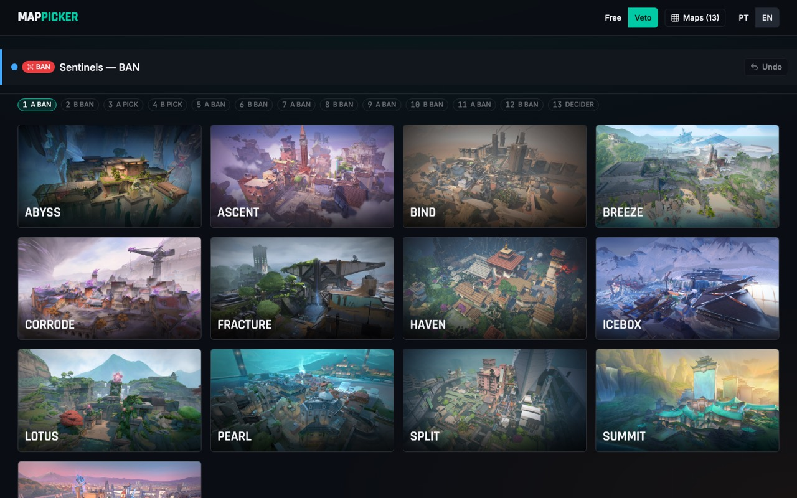
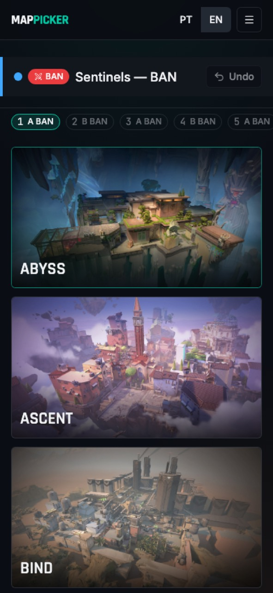

# MapPicker

Ferramenta de pick/ban de mapas de Valorant para ligas e scrims da comunidade — modo livre e
veto estruturado entre times (BO1/BO3/BO5).

[](https://github.com/TP-TheProject/MapPicker/actions/workflows/ci.yml)

<p align="center">
  
  
</p>
<p align="center">
  
</p>

## English summary

MapPicker is a Valorant map pick/ban board for community leagues and scrims (originally a
jQuery page built for "TP Community League", now a generic React app). It has two modes:

- **Free mode** — click a map to pick it (numbered in pick order) or ban it (dimmed); keyboard
  shortcuts `Enter` (pick) and `B` / `Delete` / `Backspace` (ban); undo and reset.
- **Veto mode** — Team A vs Team B, BO1/BO3/BO5, with the standard competitive ban/pick
  sequence for each format (see the rules table below, in Portuguese). After each pick the
  opponent chooses the starting side; for the decider map, the team that did **not** make the
  last ban chooses. The result summary is copyable as plain text for Discord.

Maps are fetched live from [valorant-api.com](https://valorant-api.com) (standard/pickable
maps only), with an offline static fallback bundled in the repo. The map pool is configurable
(all maps or a "competitive" preset) and persisted in `localStorage`. The UI is available in
PT-BR and EN. See the sections below (in Portuguese) for setup, scripts, and project
structure — they apply regardless of your reading language.

## Funcionalidades

- **Modo livre**: clique para escolher (numerado na ordem de pick) ou banir (mapa escurecido);
  atalhos de teclado `Enter` para pick e `B` / `Delete` / `Backspace` para ban; desfazer e
  resetar a qualquer momento.
- **Modo veto**: fluxo guiado Time A vs Time B em BO1, BO3 ou BO5, com escolha de lado após
  cada pick e resumo final copiável para colar no Discord.
- **Pool de mapas configurável**: todos os mapas padrão ou um preset "competitivo", com a
  seleção salva no navegador (`localStorage`).
- **Lista de mapas ao vivo**: busca em valorant-api.com (apenas mapas jogáveis, isto é, com
  `tacticalDescription` preenchido); se a API falhar, expirar o tempo limite ou devolver uma
  lista vazia, o app cai automaticamente para uma lista offline embutida com imagens locais.
- **PT-BR e EN**: toda a interface tem textos traduzidos nos dois idiomas, com troca em tempo
  real.

## Regras do veto

Cada formato segue uma sequência fixa de banimentos/escolhas e depois alterna banimentos até
sobrar um único mapa, que vira o **decisivo** automaticamente. Após cada pick, o time
adversário escolhe o lado inicial (ataque/defesa); no decisivo, quem escolhe o lado é o time
que **não** fez o último banimento.

| Formato | Pool mínimo | Sequência fixa                           | Depois da sequência fixa                       |
| ------- | ----------- | ---------------------------------------- | ---------------------------------------------- |
| BO1     | 2 mapas     | (nenhuma)                                | Bans alternados (A, B, A, B, ...) até sobrar 1 |
| BO3     | 5 mapas     | ban (A), ban (B), pick (A), pick (B)     | Bans alternados até sobrar 1 (decisivo)        |
| BO5     | 7 mapas     | ban (A), ban (B), pick, pick, pick, pick | Bans alternados até sobrar 1 (decisivo)        |

Exemplo com pool de 7 mapas em BO5 (mínimo exigido para esse formato):

1. Time A bane o mapa 1
2. Time B bane o mapa 2
3. Time A escolhe o mapa 3 (Time B escolhe o lado)
4. Time B escolhe o mapa 4 (Time A escolhe o lado)
5. Time A escolhe o mapa 5 (Time B escolhe o lado)
6. Time B escolhe o mapa 6 (Time A escolhe o lado)
7. Sobra 1 mapa → **decisivo**; quem não baniu por último escolhe o lado

## Stack

- [React 19](https://react.dev) + [TypeScript](https://www.typescriptlang.org)
- [Vite](https://vite.dev) (build/dev server)
- [Tailwind CSS 4](https://tailwindcss.com) + [Radix UI](https://www.radix-ui.com) (primitivos
  acessíveis, via `radix-ui`) + [shadcn](https://ui.shadcn.com)-style components em
  `src/components/ui`
- [TanStack Query](https://tanstack.com/query) para buscar e cachear a lista de mapas
- [React Hook Form](https://react-hook-form.com) + [Zod](https://zod.dev) para o formulário de
  configuração do veto
- [Vitest](https://vitest.dev) + [Testing Library](https://testing-library.com) para testes
- [ESLint](https://eslint.org) + [Prettier](https://prettier.io) para lint e formatação

## Requisitos

- Node.js `26` (versão fixada em [`.nvmrc`](.nvmrc) e usada no CI).
- npm (vem com o Node)

## Como rodar

```bash
# instalar dependências
npm install

# ambiente de desenvolvimento (Vite dev server)
npm run dev

# build de produção (typecheck + build)
npm run build

# pré-visualizar o build de produção
npm run preview

# rodar a suíte de testes (Vitest) uma vez
npm test

# rodar Vitest em modo watch
npm run test:watch

# lint (ESLint)
npm run lint

# checagem de tipos (tsc -b)
npm run typecheck

# formatar todos os arquivos (Prettier)
npm run format
```

## Estrutura do projeto

```
src/
├── App.tsx                  # composição raiz: header, modo ativo, board, footer
├── main.tsx                 # entrypoint (providers: React Query, i18n)
├── components/               # componentes de UI (boards, cards, timeline, formulários)
│   └── ui/                   # primitivos estilo shadcn (button, dialog, toggle, ...)
├── config/
│   ├── modes.ts               # enum dos modos do app (free / veto)
│   └── pools.ts               # preset do pool competitivo (COMPETITIVE_POOL)
├── features/
│   ├── free/                  # estado do modo livre (reducer, hook, tipos)
│   ├── maps/                  # busca de mapas (api.ts), fallback offline, seleção de pool
│   └── veto/                  # motor de regras do veto (engine.ts), formatação do resumo
├── hooks/
│   └── useLocalStorage.ts     # hook genérico de persistência em localStorage
├── i18n/                      # textos PT-BR/EN e contexto de idioma
├── lib/                       # utilitários (query client, helpers de classe CSS)
└── test/                      # setup e helpers de teste (render with providers)
```

## Como atualizar o pool competitivo

O pool "competitivo" é uma lista fixa de nomes de mapas em
[`src/config/pools.ts`](src/config/pools.ts) (`COMPETITIVE_POOL`). A Riot muda essa rotação
aproximadamente a cada Act e o valorant-api.com **não** expõe qual pool está ativo — edite a
lista manualmente quando a rotação mudar. O arquivo tem um comentário `TODO(verify)` lembrando
disso.

## Quando sair um mapa novo

- **Lista ao vivo**: nada a fazer — `fetchMaps` (em
  [`src/features/maps/api.ts`](src/features/maps/api.ts)) busca a lista direto do
  valorant-api.com a cada consulta (cache de 1 dia), então mapas novos aparecem
  automaticamente assim que a API os expuser com `tacticalDescription` preenchido.
- **Fallback offline**: quando a API cai, o app usa a lista estática em
  [`src/features/maps/fallback.ts`](src/features/maps/fallback.ts). Para adicionar, remover ou
  renomear um mapa nesse fallback:
  1. Adicione/edite a entrada em `FALLBACK_MAPS` (nome, slug e `uuid` — copiados de
     `https://valorant-api.com/v1/maps`).
  2. Rode `npm run fetch:map-images` (executa
     [`scripts/fetch-map-images.mjs`](scripts/fetch-map-images.mjs)), que baixa o splash de
     cada mapa padrão da API, redimensiona/otimiza com `sharp` e grava
     `public/maps/<slug>.webp`.

## Idiomas / adicionar textos

Os textos vivem em [`src/i18n/pt.ts`](src/i18n/pt.ts) e [`src/i18n/en.ts`](src/i18n/en.ts),
como dois objetos com as mesmas chaves. `MessageKey` é derivado de `en.ts`, então o
TypeScript aponta erro de tipo em `pt.ts` (ou em qualquer componente) se as duas listas de
chaves saírem de sincronia — ao adicionar um texto novo, inclua a chave nos dois arquivos.

## CI

O workflow [`.github/workflows/ci.yml`](.github/workflows/ci.yml) roda em todo push/PR para
`main`: lint (ESLint), checagem de formatação (`prettier --check .`), typecheck, testes
(Vitest) e build, usando a versão de Node fixada em `.nvmrc`.

## Aviso legal

MapPicker não é afiliado, endossado ou patrocinado pela Riot Games. Valorant e todos os
assets relacionados (nomes, imagens de mapas etc.) são © Riot Games, Inc., usados sob a
política de conteúdo de fã da Riot ("Legal Jibber Jabber":
https://www.riotgames.com/en/legal). Os dados de mapas são obtidos de
[valorant-api.com](https://valorant-api.com), um serviço não oficial e não afiliado à Riot
Games.

## Licença

Distribuído sob a licença [MIT](LICENSE). Os assets de Valorant pertencem à Riot Games e não estão cobertos por esta licença (veja o aviso legal acima).
